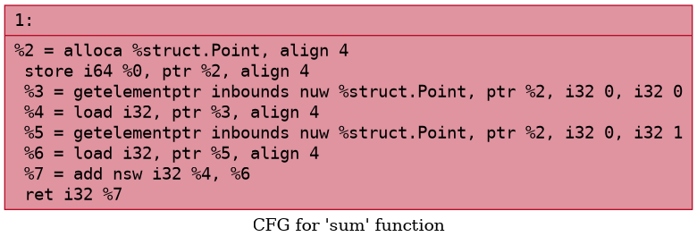
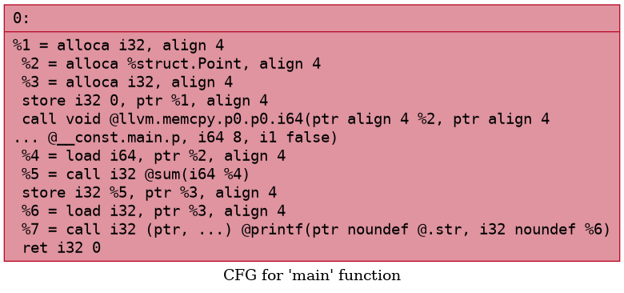

# Лабораторная работа 7. Инструментарий Clang и LLVM: анализ конструкций языка

**Автор:** Кузьмин Илья, группа АП-326.

## Постановка задачи

Познакомиться с инструментарием Clang и LLVM, освоить получение абстрактного синтаксического дерева (AST) и промежуточного представления (LLVM IR) для кода на C/C++, научиться применять базовые оптимизации, строить графы потока управления (CFG), а также анализировать влияние оптимизаций на различные синтаксические конструкции языка.

## Общее задание

1. Установить Clang, LLVM, `opt` и Graphviz.
2. Сгенерировать AST для заданного C/C++-файла.
3. Получить LLVM IR без оптимизаций (`-O0`) и с оптимизациями (`-O2`).
4. Применить оптимизации с помощью `opt` и/или флагов Clang, сравнить изменения.
5. Построить CFG для одной или нескольких функций.

### Установка инструментов

```bash
sudo apt update
sudo apt install -y clang llvm graphviz

Получение AST
clang -Xclang -ast-dump -fsyntax-only struct_point.c > ast.txt

Генерация LLVM IR
clang -S -emit-llvm -O0 struct_point.c -o ir_O0.ll
clang -S -emit-llvm -O2 struct_point.c -o ir_O2.ll

Оптимизация IR
opt -O2 -S ir_O0.ll -o ir_O2_opt.ll
diff ir_O0.ll ir_O2.ll

Построение CFG
opt -passes=dot-cfg -S ir_O0.ll -o /dev/null
mv .sum.dot sum.dot
mv .main.dot main.dot
dot -Tpng sum.dot -o sum.cfg.png
dot -Tpng main.dot -o main.cfg.png

## Индивидуальное задание
Вариант 2.2 — Структуры / записи.
#include <stdio.h>

struct Point {
    int x;
    int y;
};

int sum(struct Point p) {
    return p.x + p.y;
}

int main() {
    struct Point p = {2, 3};
    int result = sum(p);
    printf("%d\n", result);
    return 0;
}

На -O0 структура struct Point передаётся в sum как отдельный аргумент по значению. На -O2 функция sum инлайнится, и передача структуры исчезает полностью: значения полей становятся локальными константами после SROA и свёртки констант.

Исследование always_inline
Атрибут добавляется к функции sum:
__attribute__((always_inline)) int sum(struct Point p) {
    return p.x + p.y;
}

Выводы по индивидуальному заданию
На -O0 структура передаётся в функцию по значению как отдельный аргумент. На -O2 LLVM применяет SROA (разбиение структуры на отдельные скалярные значения), инлайнит функцию и сворачивает константы — в результате передача структуры исчезает полностью, а её поля становятся локальными значениями. При добавлении __attribute__((always_inline)) функция встраивается даже без оптимизаций, и передача структуры также устраняется.

Выводы
Что такое AST и зачем он нужен? AST — абстрактное синтаксическое дерево, отражает структуру программы без деталей синтаксиса. Используется компилятором для анализа и генерации кода.

Что такое LLVM IR? Промежуточное представление программы в LLVM, близкое к ассемблеру, но платформенно-независимое. Используется для оптимизаций и генерации машинного кода.

Что даёт -O2? Включает набор оптимизаций: инлайнинг, свёртка констант, SROA, удаление мёртвого кода. Код становится компактнее и быстрее.

Что такое CFG? Граф потока управления — представление функции в виде базовых блоков и переходов между ними. Помогает анализировать ветвления и циклы.

Что делает __attribute__((always_inline))? Заставляет компилятор встраивать функцию в место вызова даже без оптимизаций.

Как LLVM оптимизирует передачу структур? Разбивает структуру на отдельные поля (SROA), передаёт маленькие структуры в регистрах, инлайнит функции и сворачивает константы. В пределе передача структуры исчезает полностью.



